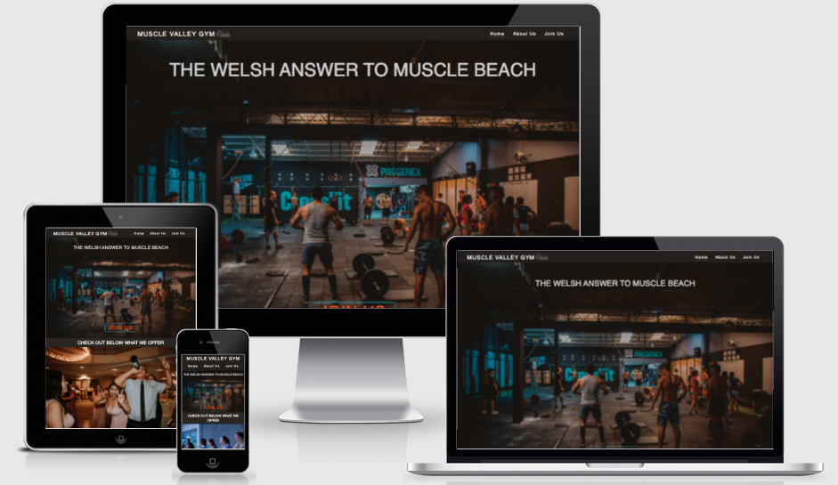
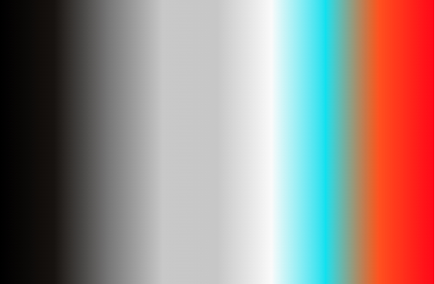

# Muscle Valley Gym - `The Welsh Answer to Muscle Beach`
---

[Click here to view website on GitHub Pages](https://tizron22.github.io/muscle-valley-gym/).

---
## Table Contents
>1. [Overview](#overview)
>2. [UX](#ux)
>    1. [Strategy](#strategy)
>    2. [Scope](#scope)
>    3. [Structure](#structure)
>    4. [Skeleton](#skeleton)
>    5. [Surface](#surface)
>3. [Features](#features)
>    1. [Existing Features](#existing-features)
>    2. [Future Feature Considerations](#future-feature-considerations)
>4. [Technologies Used](#technologies-used) 
>5. [Testing](#testing)
>6. [Deployment](#deployment)
>    1. [How this Project was Deployed](#how-this-project-was-deployed)
>    2. [How to Run this Project in your Browser](#how-to-run-this-project-in-your-browser)
>    3. [How to Run this Project Locally](#how-to-run-this-project-locally)
>7. [Credits](#credits)
>    1. [Code Snippets](#code-snippets)
>    2. [Videos](#videos)
>    3. [Pictures](#pictures)
>8. [Acknowledgements](#acknowledgements)
>9. [Disclaimer](#disclaimer)

## Overview

**Muscle Valley Gym**

Muscle Valley Gym was created from the COVID-19 pandemic after the owners notice a change to the new normal where people needed somewhere safe and engaging to interact with others whilst being able to improve both physical and mental health. 

Having a website that will allow potential customers a glimpse into the unique culture and the services the gym provides will be in most cases the first impression of the company.

---

# UX

## Strategy

### Stakeholder Requirements
>#### **External Users**
>---
>As a new user, I'd be looking at a modern website that I'll be able to engage with and be able to view the gyms culture.
>Going to a gym can be nerve racking and a little indimidating, as the website could be my first contact with the gym ths could help settle any concerns.
>As a returning customer, having a modern website along that I can interactive with and share with my friends over social media will help find me more gym partners.

>#### **Gym Owner**
>---
>As a Gym owner, I would like the website to be attractive to new customers along with showcasing our unique safe culture that we've created and how to join us.
>For returning customers I would like them to be able to review what classes we have available to them and allow them to easily share what we do to thier friends on social media. 
>With confidence that the website is modern and up to date with the most recent details for them to show. 

### User Stories
1. `As a new visitor of the webpage, I like it to flow in a way I can engage with so I understand the purpose of this site.`
2. `As a potential customer, I would like the site to eye catching and promote good culture for members.`
3. `As an interested customer, I would like to know more about the services that you provide.`
4. `As a new customer, I would like to easily join the gym online.`
---

## Scope

### Requirements

> Easy to Navigate and User Friendly
>- Similar structure across the pages.
>- Straight forward and uncomplicated view.

> Rememberable
>- Visitors must be able to remember the site. 
>- Having a slogan will help with this.

> Show the inclusive culture
>- Include images of various members.
>- Able to show that this gym is a home for everyone.
>- Explain the reasoning behind the gym.
---

## Structure

>### All Sheets
>- In the header to include gym name, logo and links to other sheets on the site.
>- In the footer include to include gym location, opening hours and social media links.

>### Home Page
>- Includes large hero image showing part of the gym set up with a link to the join-us page.
>- A carousel for various images to display the services provided.
>- Allow vistors to view some testimonies from customers to show there experience with the company.

>### About-Us Page
>- Shows a montage video of people working out to an upbeat theme.
>- Explains the reason behind the gym, phlosiphy and aims for culture.
>- Includes images to aid in showcasing our culture.
>- A list of some of the services we provide. 

>### Join-Us
>- Shows the membership structure and cost involved in each level.
>- Allows users to register an interest to joining using a form.
---

## Skeleton

### Wireframes

>- [Home Page Wireframe](./assets/wireframes/home-page.pdf)
>- [About-Us Page Wireframe](./assets/wireframes/about-us-page.pdf)
>- [Join-Us Page Wireframe](./assets/wireframes/join-now-page.pdf)

Changes were made during development from the wireframes to improve the flow and user engagement when using the site. 

## Surface

>### Typography
> When deciding which font to use I chose `Calibri`, as most microsoft 365 applications will use this as a default which would be the one most people will be familiar with and will find the site easier to engage with.

>### Images
> All the images used in the project were taken from Unsplash and they were selected basis on relevance to the culture that was to be portrayed on the site. 

>### Video
> The video used in the project was taken from YouTube, licencing for this is free and credit is further down on the readme.

>### Logo
>- For the logo, this was created using Font Awesome icons to be uniquely identifiable to the gym where the dumbbell represents muscle and the two mountain icons close together represent a valley.
>- Both combined together is `Muscle Valley`. 

>### Colour Scheme
>When choosing the colour scheme it was based on the comptibility with the hero image of the index page, due to the dark nature of the image a darker theme was chosen to compliment this.
>
>After the background colour was picked, the rest of the colours were chosen based on if the stood out clearly to the user and the infomation was able to be read without issue. 
>
> The main colours used are:
>- Background = rbga(22, 18, 15, 0.996)
>- Font = #fafafa
>
>Here are all of the colours that were used on the site:- 

---
## Features

### Existing Features

>#### Responsive Layout and design
>- The site was built with responsiveness in mind, starting from Moto G4 view and developing the site out from this screen size first as a vast amount of users main access point to the internet will be from a mobile device. 
>- Once developed on the smaller screen this was scaled upwards to larger devices. 
>- Using flex-box for the responsiveness removes the need for hard coding and various media queries for each size screen.

>#### Navigation Bar
>- This feature was created to be at the top of the site where users will be able to switch between the different sheets that have been created, in addtion to displaying the gym name and logo.
>- On each sheet the gym name and logo will be on the left then the menu options will be on the right. (On a smaller screen, gym name will be on the top and menu just underneath.)
>- When clicking on the 'Home' option or 'Muscle Valley Gym' name and logo change the page to the index.html sheet/Home page.
>- When the clicking on the 'About-us' option this will change the page to the about-us.html sheet/About Us Page. 
>- When clicking on the 'Join Us' option this will change the page to the join-us.html/Join Us Page.
>- When hovering over the menu options the background will lighten to show that if clicked this option would be the link the page will go to. 
>- An underline will show underneath the exisiting page to remaind the user which page they are reviewing.

>#### Footer
>- This feature was created to be at the bottom of the site where the users will be able to obain further infomation such as location, opening time and socail media links. 
>- On each sheet from left to right evenly spaced out will show Map location of gym, gym address and telephone number, opening hours and social media links. (On smaller screens instead of left to right it will be top to bottom.)
>- When clicking on one of the social media icons will open up a new tab and direct you to that social media account:-
>   - Clicking on the Facebook icon will open a new page for Facebook.
>   - Clicking on the Twitter icon will open a new page for Twitter.
>   - Clicking on the Instagram icon will open a new page for Instagram.
>   - Clicking on the TikTok icon will open a new page for TikTok.
>- When hovering over a social media icon the icon colour will change. 

>#### Glowing Join Us Border
>- On the home page within the hero image towards the bottom of the image is the `Join Us` text. 
>- The border will glow blue every 3 seconds and when the mouse is hovering over it the animation will pause where the text will turn red to highlight. 
>- This feature will entice the user to click on the link.

>#### Carousel
>- The carousel was created to provide 6 visual representation into some of the services that is provided by the gym underneath the hero image on the home page.
>- Every 3 seconds the image change to then next one and remain on a consistent loop.
>- When hovered the carousel will pause until the mouse haves moved. 
>- Using the arrows on either side of the image will either go to the next image or back to the previous one.
>- Near the bottom of the carousel are dashes to highlight the image that is currently selected and how many are present in the carousel.

>#### Membership Levels Join-Us
>- When the `Join Us` text is hovered the background of the text becomes lighter to highlight this is a clickable action.
>- This will entice the user to click it which will open up a modal.

>#### Modals
>- The model gathers details the visitors details to be able to register interest in joining the gym, with the details gathered will be necessary to establish rapport in the inital contact for signing up to the membership.
>- All the feilds on the modal are required to be filled in otherwise the form won't be able to be submitted. 
>- To close the modal either the 'X' at the top right of the modal or the 'Close' button at the bottom right will need to be clicked.
>- When hovering over the 'Submit' the button will turn to a darker blue, to encourage the user to click it.
>- When the 'Submit' button is clicked the form details will be submitted to the selected location.

### Future Feature Considerations

Due to current knowledge with Web Development, the below are enhancements that would improve user experience and allow more self-service when it comes to the membership of the gym.

>#### Membership Sign Up
> An area where potential members are able to sign up, select and create a direct debit for membership on the website would enhance user experience when using the website. 

>#### Members Area
> An area where where exisiting members are able to login and access members only content, change the type of membership, update bank details, sign up to classes and much more for improved user experience/autonomy for the business.   

---

## Technologies Used

>- The project was written in HTML and CSS.
>- The project uses [BootStrap v5.0.2](https://getbootstrap.com/docs/5.0/getting-started/introduction/) for site standardisation, carousel and modal functionality.
>- The project uses [FontAwesome](https://fontawesome.com/) for the free icons used for web development.
>- The project was written in [Visual Studio Code IDE](https://code.visualstudio.com/). 
>- The project was tested utalising [Live Server](https://marketplace.visualstudio.com/items?itemName=ritwickdey.LiveServer) extention in VS code.
>- The project uses [GIT](https://git-scm.com/) for verison control and [GitHub](https://github.com/) as a remote repository.
>- The project uses [GitHub Pages](https://pages.github.com/) for hosting the site.
>- The project's wireframes were designed in [Balsamiq](https://balsamiq.com/wireframes/).
>- The project's HTML was validated using [W3C HTML markup validator](https://validator.w3.org/).
>- The project's CSS was validated using [W3C jigsaw CSS validator](https://jigsaw.w3.org/css-validator/).
>- The project's performance and accessibility was tested using [Google Chrome's Lighthouse](https://developers.google.com/web/tools/lighthouse) and [WebAim's W.A.V.E](https://wave.webaim.org/).
>- The project's images were compressed via [tinyjpg](https://tinyjpg.com/) to improve the sites performance.
---
# Testing

The testing documentation can be found here:- [TESTING.md](TESTING.md)

---

# Deployment

>## How this Project was Deployed
>This project was deployed to GitHub pages via the following steps:
> 1. Log into [GitHub](https://github.com/).
> 2. From the list of Repositories then select [tizron22/muscle-valley-gym](https://github.com/tizron22/muscle-valley-gym).
> 3. From the Repository sub-headings then select "Settings".
> 4. Within the settings list underneath "Options" then select "Pages".
> 5. From the dropdown list under the "Source" heading then select "main".
> 6. A second drop-down menu that appears should remain as the default value "/root".
> 7. Press save. 
> 8. On Page refresh navigate to the "Pages" in settings and the link to the deployed site should be visibile in a green sub-section with a tick icon next to it on the left.
>
>As this project was created on the main branch all changes made to the repository are shown in the deployed project within a few minutes from being pushed.

>## How to Run this Project in your Browser
> 1. Install the [Google Chrome](https://www.google.co.uk/chrome/) browser.
> 2. Install [GitPod](https://www.gitpod.io/docs/browser-extension/) browser extension.
> 3. Create a [GitHub](https://github.com/join) account. 
> 4. Log in to [Gitpod](https://gitpod.io/login/) using your GitHub account.
> 5. Visit Muscle Valley Gym [GitHub Repository](https://github.com/tizron22/muscle-valley-gym).
> 6. Open the repository in Gitpod:
>    - Click the green "Gitpod" icon at the top of the Repository, or
>    - Click this [link](https://gitpod.io/#https://github.com/tizron22/muscle-valley-gym).
> 7. A new workspace should open with the current code of the main branch. Any changes made to the main branch after this point will not be updated in your Gitpod workspace automatically.

>## How to Run this Project Locally
>>### Cloning the Repository
>> 1. Visit Muscle Valley Gym [GitHub Repository](https://github.com/tizron22/muscle-valley-gym).
>> 2. Click the "Code" dropdown box above the repository's file explorer. 
>> 3. Under the "Clone" heading click the "HTTPS" sub-heading.
>> 4. Click the clipboard icon or manually copy the text presented: `https://github.com/tizron22/muscle-valley-gym.git`
>> 5. Open your preferred IDE (VSCode, Notepad++ etc).
>> 6. Ensure your IDE has support for GIT or has the relevant GIT extension.
>> 7. Open the terminal and create a directory where you would like the Repository to be stored.
>> 8. Type `git clone` and paste the previously copied text (`https://github.com/tizron22/muscle-valley-gym.git`) and press enter.
>> 9. The Repository will then be cloned to your selected directory. 
>
>>### Manually Downloading the Repository
>> 1. Visit Muscle Valley Gym [GitHub Repository](https://github.com/tizron22/muscle-valley-gym).
>> 2. Click the "Code" dropdown box above the repository's file explorer. 
>> 3. Click the "Download ZIP" option and this will download a copy of the selected branch's repository as a zip file.
>> 4. Locate the ZIP file downloaded to your computer and extract the ZIP to a chosen folder to which you would like the repository to be stored.
>
>>### Opening the Repository 
>> 1. Open your preferred IDE (VSCode, Notepad++ etc).
>> 2. Navigate to the chosen directory where the Repository was Cloned/Extracted.
>> 3. You will now have offline access to the contents of the project.

---

## Credits

### Code Snippets

>#### Glowing Border
>The border animation snippet was  taken from a StackOverFlow entry called `Animated glowing border using CSS` and has been adapted for the Join-Us text throughout the webpage.
>- [Animated glowing border using CSS](https://stackoverflow.com/questions/15008931/animated-glowing-border-using-css-js)

>#### Bootstrap
>Sample code used from bootstrap website as the template for this website, the code was adapted to suit needs credit for the code is from bootstrap.
>- [Get Bootstrap Carousel](https://getbootstrap.com/docs/5.0/components/carousel/)
>- [Get Bootstrap Modal](https://getbootstrap.com/docs/5.0/components/modal/)
>- [Get Bootstrap Forms](https://getbootstrap.com/docs/5.0/forms/overview/)

>#### Love Running
>Some CSS code used from the Love Running CI instructor lead project was used for this website. 
>- [Love Running 2.0](https://github.com/Code-Institute-Org/love-running-2.0)

### Videos

>#### About-us Video
> Video by [Scott Holmes Music](scottholmesmusic.com) on YouTube.com.

### Pictures

>#### Muscle Valley Logo 
>Created from using Font Awesome Solid Dumbbell and Solid Mountain icons, designing the final logo in Microsoft PowerPoint before saving the final image as an external file. 
>- [Solid Dumbell](https://upload.wikimedia.org/wikipedia/commons/1/16/Font_Awesome_5_solid_dumbbell.svg)
>- [Solid Mountain](https://upload.wikimedia.org/wikipedia/commons/7/73/Font_Awesome_5_solid_mountain.svg)

>#### Home Page Hero Image
>- Photo by [Luis Vidal](https://unsplash.com/photos/FodEsaNZs48?utm_source=unsplash&utm_medium=referral&utm_content=creditShareLink) on Unsplash.

>#### About-Us Hero Image
>- Photo by [Victor Freitas](https://unsplash.com/photos/nlZTjUZX2qo?utm_source=unsplash&utm_medium=referral&utm_content=creditShareLink) on Unsplash.
>- Photo by [Gabin Vallet](https://unsplash.com/photos/J154nEkpzlQ?utm_source=unsplash&utm_medium=referral&utm_content=creditShareLink) on Unsplash.

>#### Join-Us Hero Image
>- Photo by [Danielle Cerullo](https://unsplash.com/photos/CQfNt66ttZM?utm_source=unsplash&utm_medium=referral&utm_content=creditShareLink) on Unsplash.

>#### Carousel Images
>- **Cycling** - Photo by [Trust "Tru" Katsande](https://unsplash.com/photos/A_ftsTh53lM?utm_source=unsplash&utm_medium=referral&utm_content=creditShareLink) on Unsplash.
>- **Workout Machines** - Photo by [ŞULE MAKAROĞLU](https://unsplash.com/photos/YFmvjO3TP_s?utm_source=unsplash&utm_medium=referral&utm_content=creditShareLink) on Unsplash.
>- **Free Weights** - Photo by [Sushil Ghimire](https://unsplash.com/photos/eFx1KZhaSvo?utm_source=unsplash&utm_medium=referral&utm_content=creditShareLink) on Unsplash.
>- **Yoga** - Photo by [Anupam Mahapatra](https://unsplash.com/photos/Vz0RbclzG_w?utm_source=unsplash&utm_medium=referral&utm_content=creditShareLink) on Unsplash
>- **Aerobics** - Photo by [Sven Mieke](https://unsplash.com/photos/Lx_GDv7VA9M?utm_source=unsplash&utm_medium=referral&utm_content=creditShareLink) on Unsplash.
>- **Personal Training** - Photo by [Jonathan Borba](https://unsplash.com/photos/R0y_bEUjiOM?utm_source=unsplash&utm_medium=referral&utm_content=creditShareLink) on Unsplash.
>- **Club Running** - Photo by [Sherise VD](https://unsplash.com/photos/Atohf63B8Dg?utm_source=unsplash&utm_medium=referral&utm_content=creditShareLink) on Unsplash.
>- **Social Gatherings** - Photo by [Omar Lopez](https://unsplash.com/photos/vsgdG95Ehyo?utm_source=unsplash&utm_medium=referral&utm_content=creditShareLink) on Unsplash.
---

# Acknowledgements

---
# Disclaimer
**This website is for educational purposes only.**
-
---