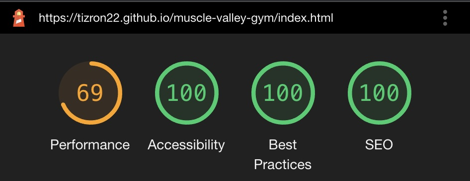
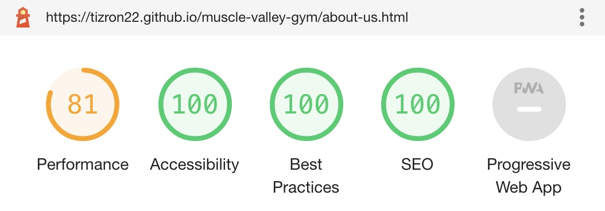
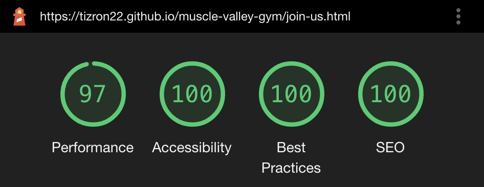

# Muscle Valley Gym - `Testing Documentation`

The README documentation can be found here:- [README.md](./README.md)

[Click here to view website on GitHub Pages](https://tizron22.github.io/muscle-valley-gym/).

---

# Table of contents

>1. [User Story Testing](#user-story-testing)
>2. [Feature Testing](#feature-testing)
>3. [Browser Testing](#browser-testing)
>4. [Automated Testing](#automated-testing)
>5. [Significant Bugs](#significant-bugs)
---

# User Story Testing

>**As a new visitor of the webpage, I like it to flow in a way I can engage with so I understand the purpose of this site.**
>- The website has a consitent pattern with the Nav bar at the top, footer at the bottom and content in the middle of the site. 
>- The website follows a logical pattern where users are able to use with no prior knowledge.

>**As a potential customer, I would like the site to eye catching and promote good culture for members.**
>- Each page will show different elements to help draw the eye to the content within.
>- Images were selected based on promoting equality and inclusion to highlight the unique culture. 
>- The images used are high-quality and relevent to the gym.

>**As an interested customer, I would like to know more about the services that you provide.**
>- Users are able to review the services provided on all 3 pages.
>- Images, text and video's help to inform the user what is provided.

>**As a new customer, I would like to easily join the gym online.**
>- Users are able to click on the `Join-us` option on the nav bar with will direct the user to the join-us page.
>- On the Join-Us page users are able to submit a form to register interest to join.

---
# Feature Testing

| Feature | Outcome | Additional Comments |
|:--------|:--------|:---------|
|Responsive Layout and design | Works as intended | N/A
|Navigation Bar | Works as intended | N/A
|Footer | Works as intended | N/A
|Glowing Join Us Border | Works as intended | N/A
|Carousel | Works as intended | N/A
|Membership Levels Join-Us | Works as intended | N/A
|Modals | Works as intended | N/A
|Video Playback | Works as intended | N/A

# Browser Testing
    All functionality worked as intended.
---
# Automated Testing
>Automated testing was completed via the following third party applications:-
>- [W3 Markup Validation](https://validator.w3.org/) - For the HTML Vaildation.
>- [W3 Jigsaw](https://jigsaw.w3.org/css-validator/) - For the CSS Vaildation.
>- [Google Lighthouse](https://developers.google.com/web/tools/lighthouse) - For Performance, Accessibility, Best Practices, SEO and Progressive Web Apps.

1.[W3 Markup Validation](https://validator.w3.org/) - Testing

    Document checking completed. No errors or warnings to show.

2.[W3 Jigsaw](https://jigsaw.w3.org/css-validator/) - Testing

    Congratulations! No Error Found.
    This document validates as CSS level 3 + SVG !

3.[Google Lighthouse](https://developers.google.com/web/tools/lighthouse) - Testing

**Home**

>**Home Page Notes**
>- When testing the performance this does not impact the user experience. 
>- To help improve performance, compressing the images via tinyjpg was used which improved performance. 
>- After sharing the link to various users for feedback, the performance did not negatively impact the experience.

**About Us**

**Join Us**

---
# Significant Bugs
>**1. About-us images stretching on longer screens**
>- When using the laptop viewing in the Developer tools, the images started to become stretched and disorted. 
>- To fix this, adding `object-fit: cover;` was used which resolved the issue.

>**2. Logo merged into the Company Name**
>- On a smaller screen such as a 'iPhone 5/SE' the logo became merged in with the text instead of to the side. 
>- To fix this on screen that is a width of 329px or less the logo is no longer displayed using `display: none;` which resolved the issue.

---

---
